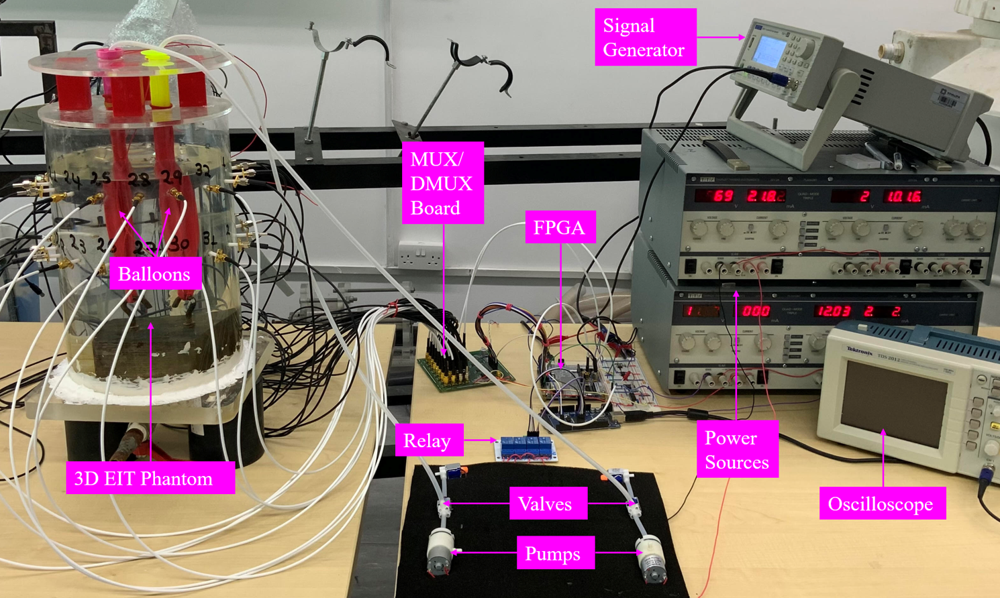

# 3-D EIT Data Capture System

## 🌐 Our Website

We are currently building a new website to lanuch this project as a startup. Please follow our website on the following link for more future updates. 

## Experimental Set-up
The image below is the full set up for 3-D EIT that can be easily configured for any type of excitation and measurement pattern, & it can also be used for 2-D EIT. 

N.B. The full code has not been disclosed publicly.

